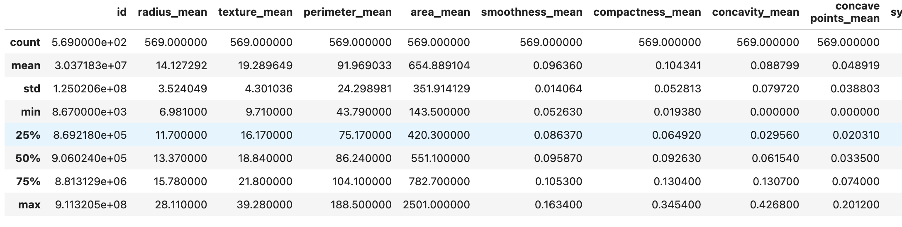
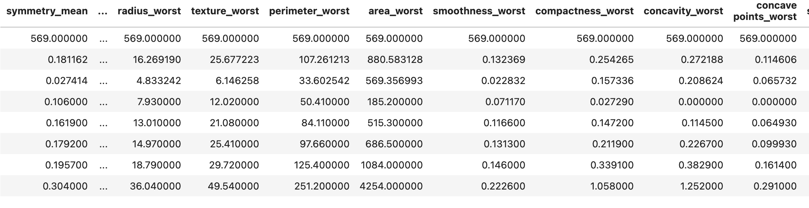

# Model Card - Support Vector Machines

This model card describes the Support Vector Machines (SVM) supervisied machine learning model, with it's aim to classify breast tissue sample data for cancer diagnosis.
 
SVMs are typically used for classification and regression tasks.  This diagnosis problem requires a binary classifier.

The svm.SVC (Support Vector Classifier) library from scikit-learn was employed.  Detailed documentation can be found here: https://scikit-learn.org/dev/modules/generated/sklearn.svm.SVC.html.  From the documentation: The implementation is based on libsvm. The fit time scales at least quadratically with the number of samples and may be impractical beyond tens of thousands of samples.

As the data set for this problem is relatively small (only ~600 samples), SVC perform well.

- SVMs aim to find the hyperplane in multi-dimensional space for classifying samples into distinct groups.
- It works by maximising the distance between the closest points from different groups.
- SVM cope well with outliers even in highly dimensional data.

## Model Description

**Input:** 

30 input features, as described in Datasheet.md

The input data is numerical but with a wide set of ranges:

To mitigiate this, a StandardScaler in the scikit learn package was used to normalise the data, as described in https://scikit-learn.org/dev/modules/generated/sklearn.preprocessing.StandardScaler.html.

## Output

The output of the model is a binary classification of 0 (Benign) or 1 (Malignant) diagnosis. 

## Model Architecture

The sample data was split 70:30 for training:test using the train_test_split method from scikit-learn.

## Data Balance

The sample data was imbalanced between the target classifications. 

SMOTE (Synthetic Minority Oversampling Technique) from imblearn.over_sampling.SMOTE library (https://imbalanced-learn.org/stable/references/generated/imblearn.over_sampling.SMOTE.html) was used to balance training data equally between benign and malignant.  SMOTE works by generating new samples using interpolation.

## Hyperparameter Tuning

Cost and kernel hyperparameters for SVM were tested using GridSearch, along with kernel-specific parameters for Polynomial (gamma and degree) and RBF (gamma).

| Kernel     | 	Parameters         | 
|------------|---------------------|
| Linear     | 	C                  | 
| Polynomial | 	C, Gamma, Degree   | 
| RBF        | 	Gamma              | 

The best performing parameters below were used:

| C         | 	Kernel     | 	Gamma       | Degree |
|-----------|-------------|--------------|--------|
| 1.0       | 	Polynomial | 	0.1         | 3      | 

## Performance

Performance for SVM, Naive Bayes and Logistic Regression were compared. SVM achievd the highest accuracy, precision, recall and F1 scores. 

* Accuracy: 0.97
* Precision: 0.98
* Recall: 0.94

## Ethical Considerations
No data used to train this model could be used to identify individuals tissue sample donors.

## Data Bias, Caveats and Recommendations
* The sample data was collected from a single region in Wisconsin, USA.  The model would need to be tested against data samples from a wide regional and demographic spectrum.  
* The model would benefit from investigating performance against data broken down by region, gender, sex and age also be trained 
* SVM performed well on this limited dataset, however for data with many more features and complexity, the high computational complexity of SVM could be problematic. 