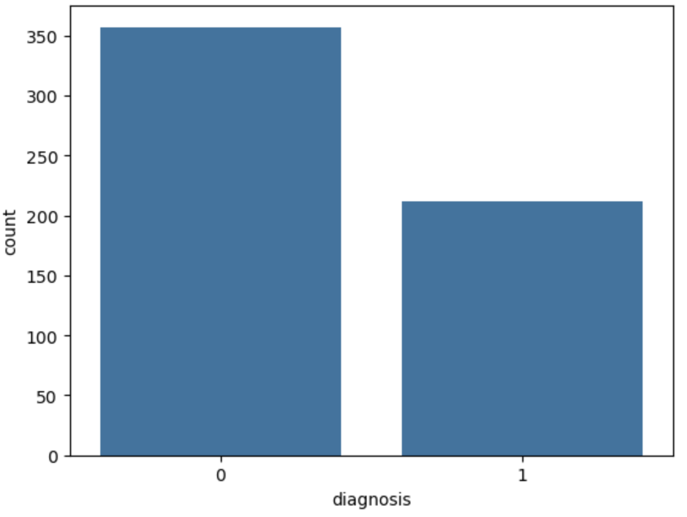
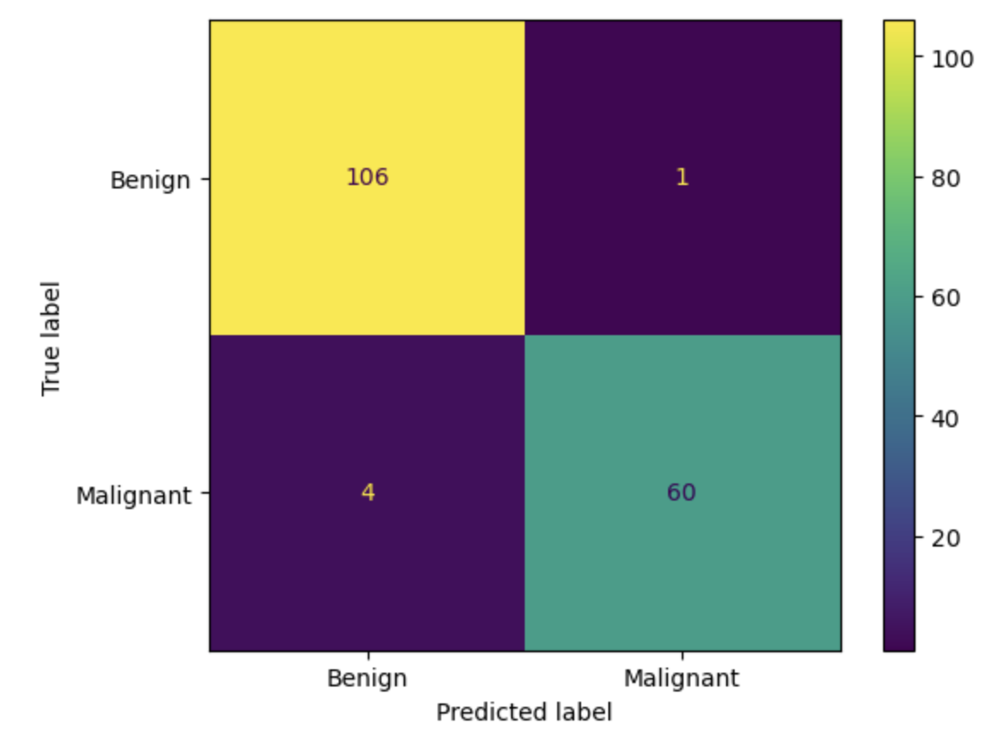
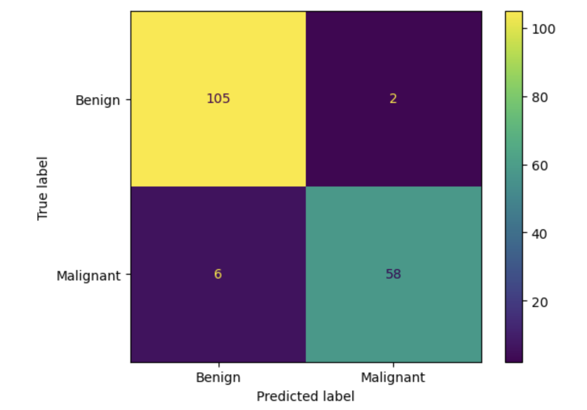
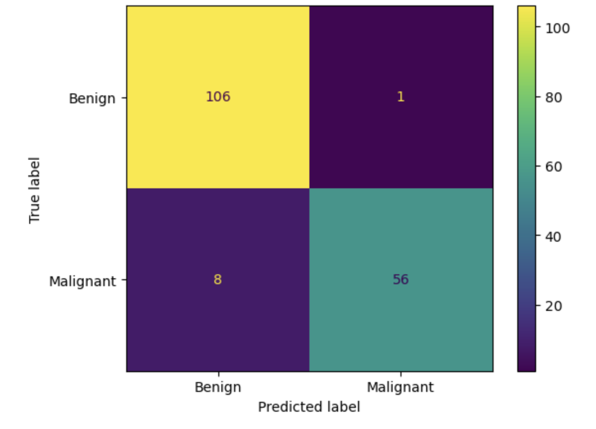

# Breast Cancer Diagnosis Using Tissue Sample Data 

## Repository Contents
##### Datasheet 
  * [Datasheet](Datasheet.md)
##### Model Card (for SVM Only) 
  * [SVM Model Card](ModelCardSVM.md)
##### Jupyter Notebooks
  * [SVM Notebook](ModelSVM.ipynb)
  * [Logisitic Regression Notebook](ModelLogisticRegression.ipynb)
  * [Naive Bayes Notebook](ModelNaiveBayes.ipynb)

## Motivation
This is a capstone project for the Imperial College AI/ML Professional Certification. It will evaluate several machine learning techniques to make a binary classification prediction for a cancer diagnosis.

### Initial Idea - CNN for medical image classification
Initially, a more complex problem was explored - to use Convolutional Neural Networks to classify medical images (e.g. CT / MRI scans).  However, after some exploratory analyses, it quickly became apparent that training such a model with any kind of success (e.g. Resnet18 or even simpler CNN architectures), would require significantly more compute power and time than practical for this project.

### Revised Idea - Classify numerical data with a manageable number of features. 
Breast tissue numerical data was used due to it's relatively small size.  It can be run on a laptop, without specialised GPUs or large amounts of compute power.  

## Data
The models would be trained and tested on the Breast Cancer Wisconsin (Diagnostic) Dataset, available from [https://archive.ics.uci.edu/dataset/17/breast+cancer+wisconsin+diagnostic]( https://archive.ics.uci.edu/dataset/17/breast+cancer+wisconsin+diagnostic ).  The input sample file for the project is [breast-cancer.csv](breast-cancer.csv 'breast-cancer.csv')

The dataset consists of 30 features.  The Diagnosis target column is a binary classification that can be used to train and test the models.

For more details about pre-processing and collection steps for the data see [Datasheet.md](Datasheet.md)

It is important to note that the data was not balanced across the target classifications.  

SMOTE (Synthetic Minority Oversampling Technique) from the Python library imblearn.over_sampling.SMOTE (https://imbalanced-learn.org/stable/references/generated/imblearn.over_sampling.SMOTE.html) was used to balance training data equally between benign and malignant.  SMOTE works by generating new samples using interpolation.

By balancing the data, we can reduce bias towards the majority classification (benign in this case) during training.
 

## Model
Three models were evaluated for the problem:

* Support Vector Machines (SVM)
  + Can achieves high accuracy in classification problems (Rodriguez & Bajorath, 2022).
  + A unique feature of SVMs is that it operates in feature spaces of increasing dimensionality, to search for hyperplanes that can linearly separate positive and negative training data.
  + If linear separation is not possible in a given feature space, the data can be mapped to a higher dimensional space, where linear separation can become possible.  The “kernel trick” can be used to explore higher dimensional space by mapping the data into using an appropriate kernel function, such as linear (scalar product), gaussian, radial basis or polynomial. 
  + Through the use of a regularisation hyper-parameter C, it can avoid overfitting to training data.
  + Can be computationally expensive.
 

* Logistic Regression
  + Easy to explain and interpret, which is important for medical diagnosis.
  + Easy to measure which input variables are the most significant, for example with Z-statistics.
  + The outcome is a positive / negative binary classification which is also desirable here.
  + Not so good for capturing more complex relationships, limited to linear separation.

* Naive Bayes
  + Simple model based on probability calculations.  Works well with numerical data such as the breast tissue sample data for this project, removing the need for converting categorical data.
  + Little scope for hyperparameter optimisation.

A model card has been created for the best performing model, SVM: [SVM Model Card](ModelCardSVM.md).

All three Jupyter Notebooks can be found in this repository, with file extension .ipynb.

## Hyperparameter Optimisation

### SVM
Cost and kernel hyperparameters for SVM were tested using GridSearch, along with kernel-specific parameters for Polynomial (gamma and degree) and RBF (gamma).

| Kernel     | 	Parameters         | 
|------------|---------------------|
| Linear     | 	C                  | 
| Polynomial | 	C, Gamma, Degree   | 
| RBF        | 	Gamma              | 

The best performing parameters below were used:

| C         | 	Kernel     | 	Gamma       | Degree |
|-----------|-------------|--------------|--------|
| 1.0       | 	Polynomial | 	0.1         | 3      |

 Grid search was used here so that the three kernel types could easily be compared, alongside the differing numerical hyperparameters.

### Logistic Regression

Cost and solver hyperparameters for Logistic Regression were tested using BayesSearch, with L2 penalty function. L2 regularization can help prevent overfitting.  The ranges / discrete values optimised with Bayes were:

    'C': (1e-6, 1e+6),
    'solver': (['liblinear','newton-cg','lbfgs']),  
    'penalty': (['l2'])

The best performing parameters were:

    'C': 410103.95885390375,
    'penalty': 'l2',
    'solver', 'lbfgs'

 (C=410103.95885390375, penalty='l2', solver='lbfgs')

### Naive Bayes
No hyperparameter tuning was required for Naive Bayes.

## Results
Performance for SVM, Naive Bayes and Logistic Regression were compared. SVM achievd the highest accuracy, precision, recall and F1 scores.   

### SVM Performance

* Accuracy: 0.97
* Precision: 0.98
* Recall: 0.94

### Logistic Regression

* Accuracy: 0.95
* Precision: 0.97
* Recall: 0.91

### Naive Bayes

* Accuracy: 0.95
* Precision: 0.98
* Recall: 0.88

### Conclusion
Support Vector Machines (Support Vector Classifier specifically) performed the best for this problem for all metrics: accuracy (% of overall correct classifications), precision (% of positive classifications that are actually positive) and recall (proportion of actual positives that are correctly classified).

It is particularly important to have a high recall value for disease classification, to reduce the chance of missing positive classifications.

In this respect, Naive Bayes would be less suitable for this problem, with only 88% recall compared to 94% for SVM with optimised hyperparameters.

One caveat of using Support Vector Machines would be that for larger datasets (both number of features and number of training samples), the computational needs would be much higher than it would be for Logisitic Regression or Naive Bayes.
